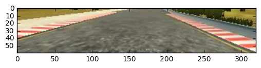
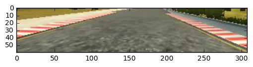
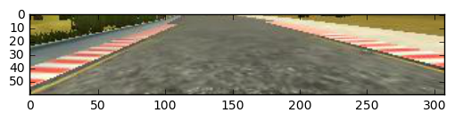
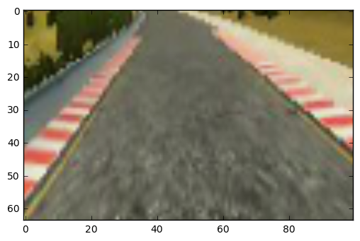

### General Info

I validated my model using the lowest resolution ("fastest" mode in the simulator). Everything more beatiful caused suffering to my macBook Air.

I only used data provided by Udacity.

### Model architecture

A have a variation of LeNet:
- normalization layer
- Conv 3x3x8 - MaxPool 2x2 - ELU nonlinearity - Dropout
- Conv 3x3x16 - MaxPool 2x2 - ELU nonlinearity - Dropout
- Conv 3x3x32 - MaxPool 2x2 - ELU nonlinearity - Dropout
- Conv 3x3x64 - MaxPool 2x2 - ELU nonlinearity - Dropout
- Conv 3x3x128 - MaxPool 2x2 - ELU nonlinearity - Dropout
- Flatten
- Fully-connected 128 - ELU nonlinearity
- Fully-connected 64 - ELU nonlinearity
- Fully-connected 16 - ELU nonlinearity

I used the Adam optimizer.

I wish I could justify this architecture, but it is the result of many hours of trial and error. I started with a model I had in project2 - 3 conv layers + 3 fully-connected layers with droupout. Messing with the sizes of these layers got me close to driving good on the first track. But the car kept flying off the track on a couple of turns close to end of the track. Then I just randomly switched dropout from fully-connected to convolutional layers and magically everything worked. But still the driving was "not stable" enough. Adding two more conv layers helped.

Nvidia came up with a really cool interpretation of this architecture applied to steering angle prediction - convolutional layers act as feature extractors, and  fully-connected layers act as a "controller for steering". This analogy of course is not strict is any sense, but still I find it usefull.

##### Surprises (things I didn't expect to happen)

I experimented with Batch Normalization, but it totally didn't work in this problem - the car always went off the track. Also, as I said above, Dropout in fully-connected layers somehow broke my model, so I left Dropout only in convolutional layers. L2 regularization also didn't work.

Also I found that you don't want to train your model for too long - everything beyond 10 epochs made the car go off the track (even though MSE continued decreasing).

##### Alternative architectures tried

A also experimented with VGG like architectures, it gave pretty much the same performance, but the model size became much bigger, so I decided to stick with LeNet.

I also tried both the [Nvidia pipeline](https://arxiv.org/abs/1604.07316) and the [comma.ai pipeline](https://github.com/commaai/research/blob/master/train_steering_model.py#L27), but my LeNet variation worked better for me for some reason.

### Data preprocessing / augmentation

The real meat in this project was data augmentation. My pipeline looks the following:
 - for each image I randomly pick which camera to use (center, left, right)
 
 - first I crop the image to throw away everything above the road and cut the car
 
 - then a randomly shift the image a little (adjusting the steering angle appropriately)
 
 - then with some probability I flip the image (changing steering angles sign)
 
 - then I change image brightness by a small random factor and rescale image to 64x100
 

### Overfitting / Model Evaluation

Now this one is very interesting. This project is really unique with respect to how you approach machine learning problems. Typically you fix some metric (e.g accuracy) and carefully control overfitting with your validation set. But in this project the only real metric is visually checking if your car made it on the track! Given two models, the one with the lower MSE is not necessarily the better model. With this in mind it is really painful to properly validate models in this project, since you can't trust your metrics. Following this logic I decided not to use validation set in this problem.

### Final Thoughts

My model should work fine on track 1 with 0.2 throttle. It should fail somewhere in the middle of track 2.

If you increace throttle to 0.3 (this is necessery to pass some hills on track 2) my car will start to fall of the track. It starts to show strange "drunk" behaviour. I was not able to fully understand why this "wiggling" happens and how to remedy it.

This was a really fun and challenging project.
